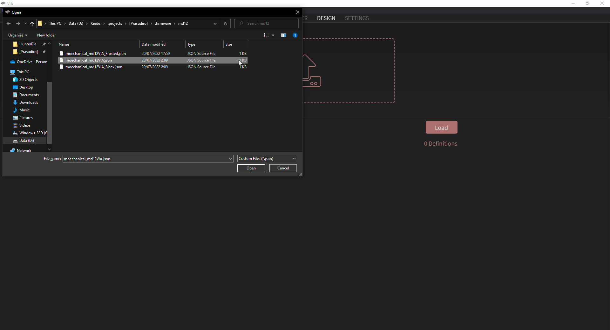
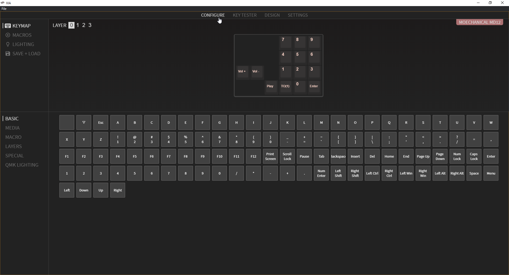

# Moechanical MD12
Moechanical MD12 is a simple Hotswap Macropad/Dumbpad with OLED, RGB per keys, RGB Underglow, and 4x3 layout, with total of 12 keys + 1 Rotary Encoder.

Support [QMK](https://qmk.fm/) firmware and VIA for keymapping.

Here you can:

- Download [Firmware](./md12/moechanical_md12_VIA_Firmware.hex) for MD12.
- Download [JSON](./md12/moechanical_md12_VIA_Map.json) for VIA keymapping.
- Download [Schematic](./md12/moechanical_md12_schematic.pdf) for debugging.

How to use VIA for keymapping:

- Download VIA from [official site](https://www.caniusevia.com/).
- Install and open it.
- Go to Design Tab and upload the JSON file.

- Go to Configure Tab to mapping your keys.

If you want to manually compile the firmware, just copy the directory of [qmk/keyboards/moechanical](./qmk/keyboards) to your qmk-firmware directory, edit and compile it.